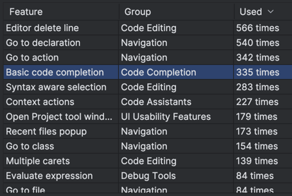

# Tips & Tricks in IntelliJ IDEA You Already Know

## My producivity

Find action `Productivity Guide`.

This is mine: code, navigation, navigation, code, code, code, navigation, navigation.

So I think this is the biggest part of my daily work in the IDE and it should be optimized.



## Copilot

Run app:  
`⌃ ⌃` - Run anything

`⌘ ⇧ \` - `Go to Endpoint` - for example `offers`

Generate curl with copilot inline chat. Get id,title,status with the `jq` (ask copilot)

Open gradle tab with `⌘ ⇧ A` (and type `Gradle`). Filter `Gradle` tab with `test` or `run`

`⌥ ⏎` - and `Open GitHub Copilot Inline Chat`

## Find action

`⌘ ⇧ A` - `Find Action` ❤️  
Search for any action, setting, plugin, shortcut. Search for something that you need at the moment.
Type action name, like `Rename`, `Go to file`, `Open Copilot chat`, `Gradle`. Assign shortcuts with `⌥ ⏎` from there.

If you see text like this `Enter Distraction Free Mode` / `Hide All Windows` - you will find action with this name in
`⌘ ⇧ A`

### other core navigation

`⌘ O` - `Go to class`  
`⌘ ⇧ O` - `Go to file`  
`⌘ ⌥ O` - `Go to symbol`, for example `OfferService.add` filters by the namespace.
You can also look for constants, methods, variables etc

## Tool windows

`⌘ ⇧ F12` - `Hide All Windows` / `Restore All Windows`

find action `Enter Distraction Free Mode`

`⌘ 1` - Project  
`⌘ 4` - Run  
`⌘ 5` - Debug  
`⌥ F12` - Terminal  
`⌘ 6` - Problems  
`⌘ 7` - Structure  
`⌘ 8` - TODO  
`⌘ 9` - Version Control

`⌘ E` - Recent files

Use `⎋` to go back from any tool window to editor. You can filter the result list by typing some text.

`⌘ ⇧ '` - `Maximize/Restore Tool Window`

`⌘ ⇧ ← / →` - `Stretch (tool window) to Left / Right`

`⌘ ⌥ ← / → / ↑ / ↓` - `Increase/Decrease width/height`

Use it to adjust width and height of any other tool window, for example `Recent Files`, `Run`, `Gradle`.

## Refactor

`Go to class` OfferService or `Go to symbol` `OfferService.add`

- `⌃ T` - `Refactor this`
- `F6` - `Move` outside exceptions class
- `⌥ F7` - `Find usages` of add method
- `⌘ F6` - `Change signature` of method add. Remove `requestId`, flip arguments
- `⌘ ⌥ C` - `Extract constant` - not working in kotlin
- `⌘ ⌥ V` - `Extract variable` ACCOUNT_STATUSES
  Move outside of function and move to companion object
- `⌘ ⌥ M` - `Extract method`
- `⌘ ⌥ N` - `Inline` everything back

Use copilot for refactor drop/take pagination

**prompt:**  
Introduce dropIfNotNull and takeIfNotNull in util package. refactor code here

For Java refactoring the best you can do is
`⌘ ⌥ ⇧ K` - `Convert Java file to Kotlin`

Check `Refactor` menu

## Keymap, assign new shortcut

My top shortcuts:

- Select file in a project view
- Annotate (git)
- Open copilot chat
- Gradle
- Open recent

Visit `Keymap` in the `Settings`, look for `Select File in a Project view`

Search in `Find Action`:

- `Move caret (...)`
- `Move caret with selection (...)`

## Replace all @Unroll

**Search and match**
`⌘ ⇧ F` and  
`⌃ ⌥ C` - `Match case`  
`⌃ ⌥ X` - `Match regex`  
`⌃ ⌥ W` - `Match word`  
Match regex `@Unroll\n` with a new line.
Additionally, run it only on the test directory. With mnemonics change project/directory etc)

To use mnemonics hold `⌥` key and click the characters on the keyboard

https://plugins.jetbrains.com/docs/intellij/mnemonics.html

`⌘ ⇧ R` - Replace in Files

`CMD ALT L` - `Reformat code` - jump to project view and reformat whole directory

Use mnemonics to optimize import or select other options

**Reformat**
`select file in a project view`
go to test directory
global reformat `⌘ ⌥ L`
Use mnemonics to optimize import and select other options

## Code editing

`F2` - Next highlighted error
`⇧ F2` - Previous highlighted error

`⌃ ⌥ ↓` - Next highlighted usage
`⌃ ⌥ ↑` - Previous highlighted usage

Find `⌘ F` 'offers' and use `⌘ G` and `⌘ ⇧ G`

`⌃ ⇧ ↓` - Next method
`⌃ ⇧ ↑` - Previous method

`⌘ ⇧ M` - Move caret to matching brace

`⌘ ⇧ ⌫` - Last edit location

## Live templates, postfix completion, surround with

type `ifn` in editor

Visit live templates in the settings and check other options
For ifn it's:

```
if ($VAR$ == null) {
    $END$
}
```

**Postfix completion**
`anyVariable.ifn`

Visit postfix completion in the settings and check other options

`⌘ ⇧ ⏎` - Complete current statement

Multiline cursor:
- double press and hold `⌥`. add cursor with arrow
- `⌃ G` - Find next occurrence
- hold `⇧ ⌥` and click

https://www.jetbrains.com/help/idea/multicursor.html

## Debugging, running, terminal

`⌃ ⌃` - Run anything
Look for the `OffersServiceTest` and run

Go to class `OffersServiceTest`  
Put caret on the single test and press `⌘ ⇧ R` - it runs a single test    
Put caret outside the method and press `⌘ ⇧ R` - tt runs all the tests in tihs class  

`⌘ D` - Run last configuration (single test, all tests, application) in the debug mode.
Use `⌥ F8` - `Evaluate expression` while debugging. With mnemonics click on `Evaluate` button

Check actions: `View breakpoints`, `Toggle breakpoints`


`Set background image`


